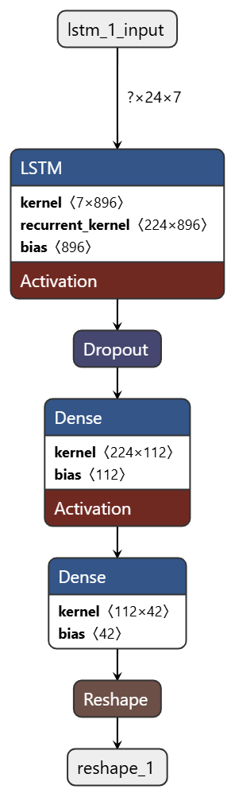
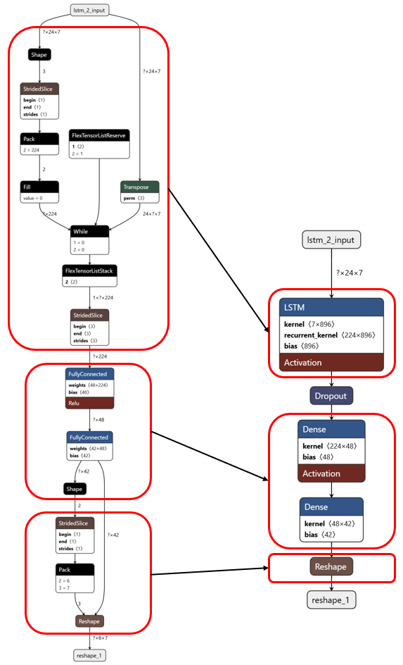
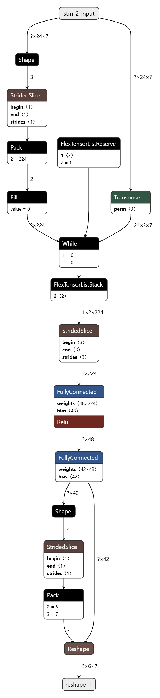

# Kurzfrist-Energieverbrauchs-Prognose und Deployment auf Edge-Geräten

## Datenaufbereitung
Die Klasse "LoadAndPrepareData" beinhaltet alle Schritte, um die Roh-Zeitreihen aus der UCI „Household Power Consumption“–Datei 
aufzubereiten und in ein für TensorFlow geeignetes Format zu bringen:
### 1. Hauptaufgaben
#### 1. Einlesen & Bereinigung
- Liest die Roh-Zeitreihen aus der .txt-Datei ein
- Kombiniert Date + Time zu einem Datetime Timestamp
- Interpoliert fehlende Werte entlang der Zeitachse 
- (Optional im Test-Modus) Einschränkung des DataFrames auf die ersten N Zeilen zur schnelleren Validierung

#### 2. Resampling
- Aggregiert bei Bedarf minütliche Messungen auf eine gröbere Frequenz (z.B. auf Stundenwerte)

#### 3. Zeitreihen-Split
- Teilt die aggregierten Timeseries in Training / Validation / Test Splits im Verhältnis 0.7, 0.15 und 0.15
- Wichtig: zeitlich getrennt, um Data-Leakage zu vermeiden

#### 4. Feature-Scaling
- Gewährleistet über Skalierung, dass alle Features (z. B. Global_active_power, Voltage, Sub_metering_*) in vergleichbarem Wertebereich liegen

#### 5. Sliding-Window-Erzeugung
- Baut ein Zeitbereich auf und zerlegt jeden Zeitbereich in Input der Länge window_size und Target der Länge horizon
- Durchmischt die Zeitbereiche und packt sie in Batches
- Liefert Tensorflow Dataset-Objekte, die direkt in weitere Tensorflow Methoden wie z.B. model.fit() eingesetzt werden können


### 2. Parameter der Klasse
| Parameter       | Beschreibung                                                                             |
|-----------------|------------------------------------------------------------------------------------------|
| `filepath`      | Pfad zur heruntergeladenen UCI-Datei (`.txt`)                                            |
| `na_values`     | List\[str], z. B. `["?"]`; strings, die als `NaN` gelesen werden                         |
| `resample_rule` | Resampling-Regel: `"h"` = Stunden, `"min"` = Minuten, etc.                               |
| `split_ratios`  | `(Train, Val, Test)` als Anteile der Gesamtlänge, Gesamtsumme = 1.0                      |
| `window_size`   | Anzahl vergangener Zeitschritte, die als Input ins Modell gehen                          |
| `horizon`       | Anzahl künftiger Zeitschritte, die das Modell vorhersagen soll                           |
| `batch_size`    | Anzahl Zeitbereiche pro Batch                                                            |
| `test_mode`     | Wenn `True`, werden nur `test_subset` Zeilen geladen – ideal für schnelle Pipeline-Tests |


### 3. Methodenübersicht
| Parameter                     | Beschreibung                                                                                                                                |
|-------------------------------|---------------------------------------------------------------------------------------------------------------------------------------------|
| `load_and_clean()`            | Daten einlesen + Timestamp Aggregierung + Interpolation                                                                                     |
| `resample()`                  | Aggregation der Daten auf die gewählte Frequenz                                                                                             |
| `split()`                     | Aufteilung der Zeitreihen in Trainings-, Validierungs- und Test-spilts                                                                      |
| `scale()`                     | MinMax-Skalierung der Daten                                                                                                                 |
| `make_tf_dataset(data_array)` | Aufbau von Zeitbereichen, Durschmischung, Zusammenfassung in Batches und transformation in Tensorflow format                                |
| `get_datasets()`              | Ruft alle notwendigen Datenaufarbeitungsschritte in der korrekten Reihenfolge auf und gibt Trainings-, Validierungs- und Test-spilts zurück |
| `get_scaler()`                | Liefert den MinMaxScaler, für inverse Transformation von Vorhersagen                                                                        |


### 4. Beispiel Aufruf
```python
from LoadAndPrepareData import LoadAndPrepareData

loader = LoadAndPrepareData(
    filepath="data/household_power_consumption.txt",
    window_size=24,
    horizon=6,
    batch_size=32,
)

train_ds, val_ds, test_ds = loader.get_datasets()
scaler = loader.get_scaler()
```


## Modellauswahl
Für die kurzfristige Prognose des Energieverbrauchs wurden drei Modell-Varianten ausgewählt:

| Modell      | Beschreibung                                               | Vorteile                                                                                                  | Nachteile                                                                                         |
|-------------|------------------------------------------------------------|-----------------------------------------------------------------------------------------------------------|---------------------------------------------------------------------------------------------------|
| **LSTM**    | Long Short-Term Memory mit Speicher- und Vergessens-Tor    | • Sehr gute Modellierung langer Abhängigkeiten<br>• Gut etabliert in Forecast-Tasks                       | • Viele Parameter → langsameres Training und Inferenz<br>• Höherer Speicherbedarf beim Deployment |
| **Bi-LSTM** | Bidirektionales LSTM (Vorwärts- & Rückwärts-Pfad)          | • Nutzt Kontext aus Vergangenheit und „Zukunft“<br>• Oft bessere Genauigkeit bei zyklischen Mustern       | • Doppelter Rechen- und Speicheraufwand<br>• Schwerer auf Edge-Geräten einsetzbar                 |
| **GRU**     | Gated Recurrent Unit mit nur zwei Toren (Update & Reset)   | • Weniger Parameter → schnelleres Training & Inferenz<br>• Einfachere Komprimierung für Edge- Optimierung | • In Einzelfällen leicht niedrigere Genauigkeit als LSTM        n                                 |


## Hyperparameter-Suche
...

## Visualisierung & Dashboard
...

## Edge-Optimierung

Die Edge-Optimierung besteht aus zwei Teilen. Zum einen die Konvertierung des Keras Modells in eine TensorFlow-Lite Modell und zum anderen die Ausführung auf einem Edge-Gerät. In diesem Beispile wurde dabei ein RaspberryPi verwendet. 

### Ausführen der Konvertierung

Um die Konvertierung des Keras Modells auszuführen, muss der Code in der Datei `OptimizeModel.py` ausgeführt werden. Dabei werden dann die Methoden der Klasse `EdgeDeviceOptimization` und `TestOptimizedModels` ausgeführt. 

```
...\AI-TuF-Group4>python -m src.srv.OptimizeModel
```

### Ausführen der Demo auf dem Edge-Device

Um den Code auf einem EdgeDevice wie z.B. einem RaspberryPi auszuführen, werden alle Dateien aus dem Ordner `/edgeDevice` benötigt. Zusätzlich wird noch die Klasse `LoadAndPrepareData` und die Dateien `household_power_consumption.txt` und `prediction_input_example.csv` benötigt. Die Ordnerstruktur auf dem Zielgerät muss gleich aufgebaut sein wie in diesem Projekt.
Über das Modul `main` wird eine Demo gestartet, die Daten für den 01.06.2025 12:00 Uhr bis 17:00 Uhr vorhersagt.

```
...\AI-TuF-Group4>python -m src.edgeDevice.main
```

Zu Testzwecken, kann das Script auch auf einem normalen Rechner ausgeführt werden. Dabei wird dann anstatt der TensorFlow-Lite Runtime die normale TensorFlow integration verwendet. 

### Modelloptimierung mit EdgeDeviceOptimization

Die `EdgeDeviceOptimization` Klasse konvertiert trainierte Keras-Modelle (.h5) in optimierte TensorFlow Lite (TFLite) Formate für den Einsatz auf Edge-Geräten. Dabei werden zwei verschiedene Optimierungsstufen angeboten:

#### Original Keras-Modell (.h5)
Das ursprüngliche trainierte Modell.



*Vollständige Keras-Architektur mit allen Trainings-Metadaten und Optimizer-Zuständen*

#### 1. Standard TFLite Konvertierung (ohne Optimierung)
```python
def __ConverToTfLiteWithoutOptimization(self):
```



*TFLite-Modell nach Graph-Optimierung und Metadaten-Entfernung*

Bei der Konvertierung wird jede Layer des Keras-Modells in mehrere grundlegende TFLite operatoren zerlegt, die für die Ausführung auf Embedded- oder Mobilgeräten optimiert sind. 

- **Was passiert bei der Konvertierung**:
  - **Entfernung von Trainings-Metadaten**: Keras .h5-Dateien enthalten Optimizer-Zustände, Gradienteninformationen und Trainingshistorie, die für die Inferenz nicht benötigt werden
  - **Graph-Optimierung**: Der Computational Graph wird vereinfacht - unnötige Operationen werden entfernt, redundante Berechnungen zusammengefasst
  - **Operatoren-Mapping**: Keras/TensorFlow Operationen werden auf effizientere TFLite-Operatoren gemappt
  - **Speicher-Layout Optimierung**: Tensoren werden in einem für mobile Geräte optimierten Format gespeichert
  - **Format-Komprimierung**: Das binäre TFLite-Format ist kompakter als das HDF5-Format (.h5)

- **Vorteile**: 
  - **Deutlich kleinere Dateigröße**: Typisch 50-70% Reduktion gegenüber .h5-Format durch Entfernung der Trainings-Metadaten
  - **Beibehaltung der ursprünglichen Modellgenauigkeit**: Keine Präzisionsverluste, da die Gewichte unverändert bleiben
  - **Optimierte Inferenz**: Graph-Optimierungen führen zu schnellerer Ausführung
  - **TFLite-Runtime Kompatibilität**: Speziell für mobile/embedded Geräte entwickelte, schlanke Runtime (nur ~1MB vs. >100MB für TensorFlow)

#### 2. Quantisierte TFLite Konvertierung (mit Optimierung)
```python
def __ConvertToTfLiteWithOptimization(self):
```



*Quantisiertes TFLite-Modell mit 8-Bit Gewichten für maximale Kompression*

- **Was passiert**: Dynamische Quantisierung - Gewichte werden von 32-Bit Gleitkommazahlen (float32) auf 8-Bit Ganzzahlen (int8) reduziert
- **Vorteile**:
  - **Speichereffizienz**: Bis zu 75% kleinere Modellgröße
  - **Schnellere Inferenz**: Integer-Operationen sind auf vielen Prozessoren schneller als Gleitkomma-Operationen  
  - **Geringerer Energieverbrauch**: Besonders wichtig für batteriebetriebene Edge-Geräte
  - **Bessere Cache-Nutzung**: Kleinere Modelle passen besser in den Prozessor-Cache
- **Nachteile**: Leichter Genauigkeitsverlust durch Rundungsfehler bei der Quantisierung

#### 3. Kompatibilität für LSTM-Modelle
```python
self.modelConverter.target_spec.supported_ops = [
    tf.lite.OpsSet.TFLITE_BUILTINS,  # Standard TFLite-Operationen
    tf.lite.OpsSet.SELECT_TF_OPS     # TensorFlow-Operationen für dynamische Tensoren
]
self.modelConverter._experimental_lower_tensor_list_ops = False
```

**Warum ist diese Konfiguration bei LSTM-Modellen notwendig?**

- **Dynamische Sequenzlängen**: LSTM-Schichten arbeiten mit variablen Eingabelängen und internen Zuständen, die sich während der Verarbeitung ändern. Standard TFLite-Operationen sind für statische Tensoren mit festen Dimensionen optimiert.

- **Unfolding-Problem**: LSTMs "entfalten" sich über die Zeit - jeder Zeitschritt ist eine separate Operation. TFLite kann diese dynamischen Strukturen nicht nativ mit Standard-Operationen abbilden.

**Was bewirken die Konfigurationsoptionen?**

- **`tf.lite.OpsSet.SELECT_TF_OPS`**: Ermöglicht die Verwendung der ursprünglichen TensorFlow-Operationen für komplexe LSTM-Berechnungen, die nicht in TFLite-Standard-Operationen konvertiert werden können.

- **`_experimental_lower_tensor_list_ops = False`**: Verhindert die automatische Konvertierung von TensorList-Operationen in Low-Level-Operationen, die bei LSTM-Modellen oft fehlschlagen oder ineffizient sind.

**Kompromiss**: Diese Konfiguration sorgt für Funktionalität, macht das Modell aber etwas größer und weniger optimiert, da TensorFlow-Operationen ressourcenintensiver sind als native TFLite-Operationen. Für Zeitreihenmodelle mit LSTM-Schichten ist dies jedoch meist der einzige Weg, um eine erfolgreiche Konvertierung zu gewährleisten.

### Test der optimierten Modelle

#### Fehlermetriken und Vergleich
Der Vergleich zwischen Original- und optimierten Modellen erfolgt über verschiedene Fehlermetriken:

**Mean Absolute Error (MAE)**:
- **Berechnung**: Durchschnitt der absoluten Differenzen zwischen Vorhersage und tatsächlichen Werten
- **Interpretation**: Direkte Aussage über den durchschnittlichen Fehler in den ursprünglichen Einheiten (z.B. kWh)
- **Vorteil**: Leicht interpretierbar, nicht stark von Ausreißern beeinflusst

**Root Mean Square Error (RMSE)**:
- **Berechnung**: Quadratwurzel des Durchschnitts der quadrierten Fehler
- **Interpretation**: Bestraft größere Fehler stärker als MAE
- **Vorteil**: Zeigt die Variabilität der Vorhersagefehler auf

**Mean Absolute Percentage Error (MAPE)**:
- **Berechnung**: Durchschnitt der prozentualen absoluten Abweichungen
- **Interpretation**: Relative Fehlermetrik in Prozent, unabhängig von der Größenordnung der Werte
- **Vorteil**: Vergleichbarkeit zwischen verschiedenen Datensätzen und Zeiträumen

#### Modellgrößenvergleich
```python
def __CompareModelSizes(self):
```
Diese Methode vergleicht automatisch die Dateigrößen:
- **Original Keras-Modell (.h5)**: Vollständiges Modell mit allen Metadaten
- **Standard TFLite-Modell**: Bereits optimiert für mobile/embedded Geräte
- **Quantisiertes TFLite-Modell**: Maximale Kompression für ressourcenbeschränkte Umgebungen

### Edge-Device Inferenz

#### EdgeDeviceInference Klasse
Die `EdgeDeviceInference` Klasse übernimmt die Ausführung der optimierten Modelle auf Edge-Geräten:

**Flexible TFLite-Runtime Unterstützung**:
```python
try:
    import tflite_runtime.interpreter as tflite  # Für Edge-Geräte
except ImportError:
    import tensorflow as tf  # Fallback für Development-Umgebungen
```

**Hauptfunktionen**:
- **Modell laden**: Initialisierung des TFLite-Interpreters
- **Tensoren allokieren**: Speicher für Ein- und Ausgabedaten reservieren
- **Inferenz ausführen**: Vorhersage mit Zeitmessung
- **Performance-Monitoring**: Ausgabe der Inferenzzeit für Optimierungsanalysen

#### Praktische Anwendung (main.py)
Die `main.py` demonstriert eine vollständige Inferenz-Pipeline:

1. **Datenvorverarbeitung**: 
   - Laden von Beispieldaten für zukünftige Zeitpunkte (01.06.2025 12:00-18:00)
   - Anwendung der gleichen Skalierung wie beim Training
   - Formatierung in die korrekte Eingabeform (window_size=24 Stunden)

2. **Vergleichende Vorhersagen**:
   - Ausführung mit Standard-TFLite-Modell
   - Ausführung mit quantisiertem TFLite-Modell

3. **Ergebnisvisualisierung**:
   - Farbkodierte Ausgabe für verschiedene Features (Global_active_power, Global_reactive_power, etc.)
   - Zeitstempel-basierte Darstellung der Vorhersagen
   - Rücktransformation auf Originalskala für interpretierbare Werte

